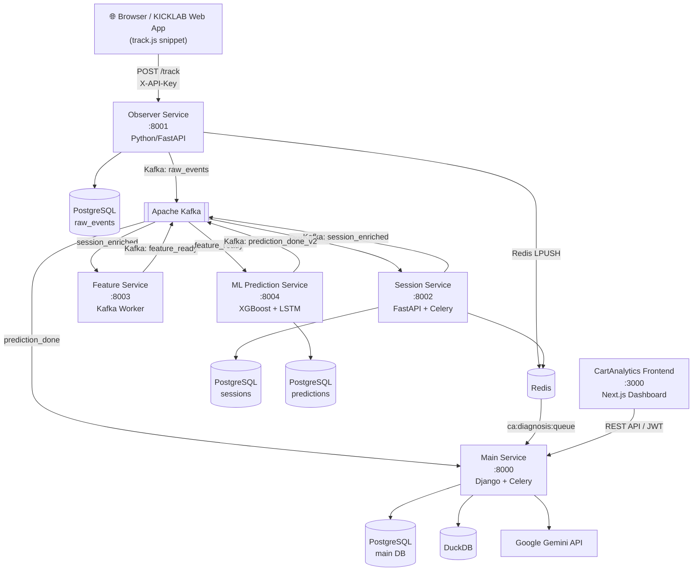

# Системийн архитектур

## Дата урсгалын диаграм

## Үйлчилгээнүүдийн харилцаа

| Илгээгч | Protocol / Topic | Хүлээн авагч |
|---------|-----------------|--------------|
| Browser | HTTP POST `/track` | Observer Service |
| Observer | Kafka `raw_events` | Session Service |
| Observer | Redis LPUSH `ca:events:*` | Session/Main Service |
| Session | Kafka `session_enriched` | Feature Service |
| Feature | Kafka `feature_ready` | ML Prediction Service |
| ML Service | Kafka `prediction_done_v2` | Main Service |
| Main Service | REST API (JWT) | CartAnalytics Frontend |

## Kafka Topic-үүдийн бүрэн жагсаалт

| Topic нэр | Producer | Consumer | Зорилго |
|-----------|----------|----------|---------|
| `raw_events` | Observer Service | Session Service | Browser event |
| `session_enriched` | Session Service | Feature Service | Баяжуулсан session |
| `feature_ready` | Feature Service | ML Prediction Service | 76-field feature vector |
| `prediction_done` | ML Service | Main Service | Legacy prediction |
| `prediction_done_v2` | ML Service | Main Service | V2 prediction |
