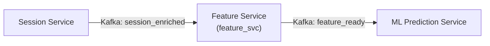

# Feature Service

| | |
|---|---|
| **Port** | 8003 (HTTP sidecar) |
| **Технологи** | Python 3.11/3.12, FastAPI, aiokafka, Pydantic v2, Pandas |
| **Төрөл** | Kafka event consumer + producer |
| **Хийдэг зүйл** | `session_enriched` topic-оос уншиж, 76-field behavioral feature vector тооцоолж, `feature_ready` topic руу нийтэлдэг |

## Дата урсгал

## FastAPI sidecar endpoint-үүд

| Арга | Зам | Тайлбар |
|------|-----|---------|
| GET | `/health` | Liveness + Kafka шалгалт |
| GET | `/viewer` | Debug UI |
| GET | `/viewer/status` | Runtime статус, counter-үүд |

## Pydantic загварууд

| Загвар | Зорилго |
|--------|---------|
| `SessionEnriched` | Kafka-аас ирэх мессеж |
| `AggregatedFields` | ~55 pre-aggregated behavioral field |
| `FeatureSet` | 76-field гаралтын feature vector |
| `FeatureVector` | Kafka envelope (session_id, tenant_id, version...) |
