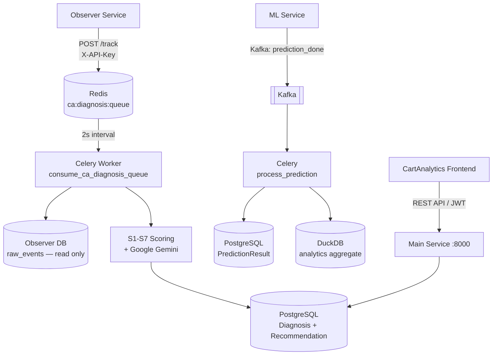

# Main Service

| | |
|---|---|
| **Port** | 8000 |
| **Технологи** | Python 3.12, Django 5.1, DRF, SimpleJWT, Celery, Redis, PostgreSQL, DuckDB, Kafka, MinIO/S3, Google Gemini |
| **Төрөл** | REST API + Celery worker + Kafka consumer |
| **Хийдэг зүйл** | Multi-tenant SaaS backend — Observer event-ийг S1-S7 behavioral scoring хийж, Gemini AI-аар Монгол recommendation гаргаж, dashboard API өгдөг |

## Дата урсгал

## Celery Beat — Scheduled Jobs

| Давтамж | Task | Тайлбар |
|---------|------|---------|
| 2 секунд | `consume_ca_diagnosis_queue_once` | Redis queue дамжуулалт |
| 30 секунд | `poll_unprocessed_sessions` | Observer DB шалгах |
| Өдөр бүр 01:00 UTC | `export_predictions_daily` | MinIO Parquet export |
