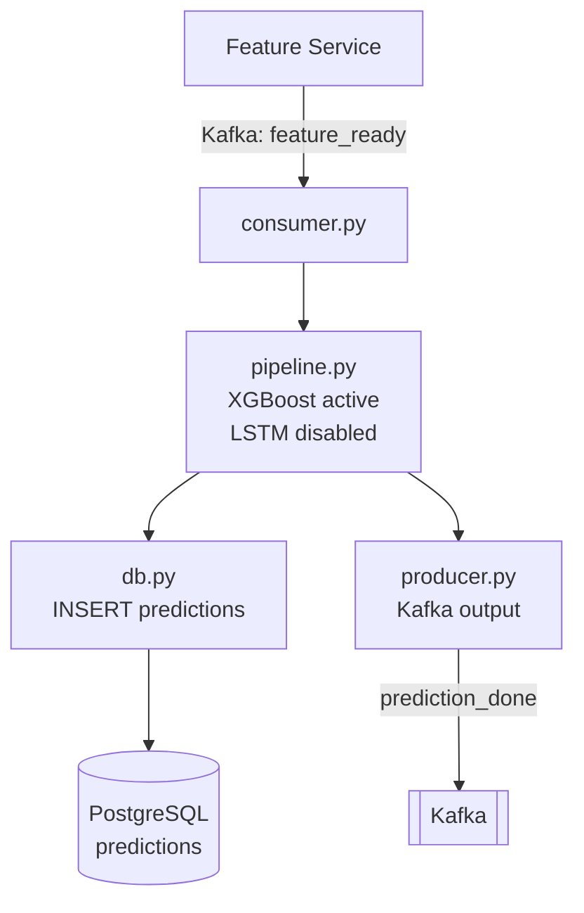

# ML Prediction Service

|  |  |
|---|---|
| **Port** | 8004 |
| **Технологи** | Python 3.11, FastAPI, aiokafka, XGBoost, optional SHAP support |
| **Төрөл** | Kafka consumer/producer + REST API |
| **Хийдэг зүйл** | `feature_ready` payload авч XGBoost abandonment probability тооцоолж, `prediction_done` topic руу нийтэлдэг |

## Дата урсгал

## Active model

MVP active inference нь XGBoost-only. `PredictionPipeline.lstm_loaded` false буцаадаг бөгөөд `lstm_score=null`, `ensemble_method=xgb_only` contract хадгалагдана.

LSTM code нь future work-д үлдсэн. Энэ MVP дээр LSTM training/evaluation artifact байхгүй тул active model гэж тайлбарлахгүй.
