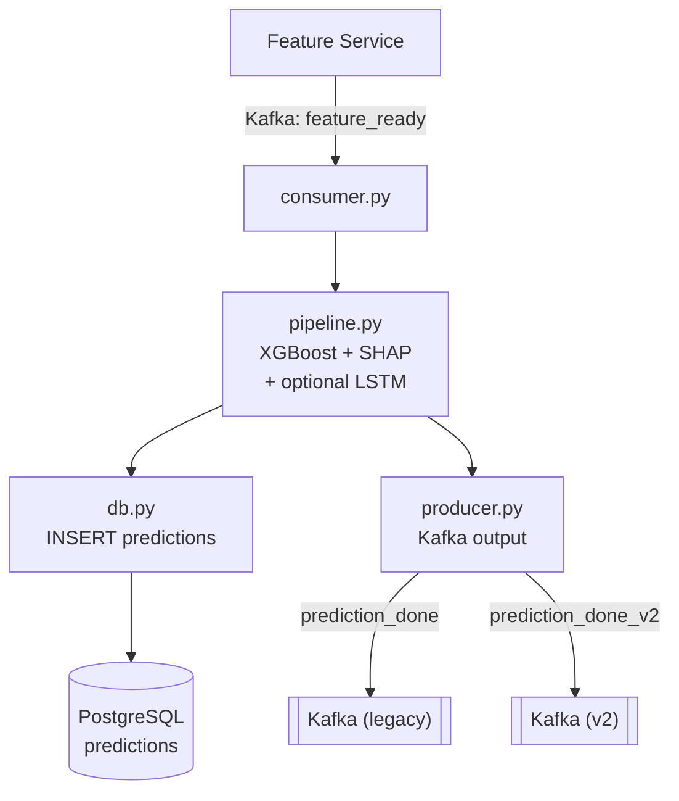

# ML Prediction Service

| | |
|---|---|
| **Port** | 8004 |
| **Технологи** | Python 3.11/3.12, FastAPI, asyncpg, aiokafka, XGBoost, PyTorch (LSTM), SHAP |
| **Төрөл** | Kafka consumer/producer + REST API |
| **Хийдэг зүйл** | Feature vector-ийг XGBoost + LSTM ensemble-ээр cart abandonment магадлал тооцоолж, PostgreSQL-д хадгалж, prediction_done_v2 topic руу нийтэлдэг |

## Дата урсгал



## Model Ensemble

```
Final Score = 0.7 × XGBoost Score + 0.3 × LSTM Score
```

- **XGBoost:** Tabular feature-д хурдан inference, SHAP-тай нийцтэй
- **LSTM:** Event sequence data-д зориулсан — 4-аас доош event байвал алгасна
- **LSTM байхгүй бол:** XGBoost-only mode (graceful degradation)
