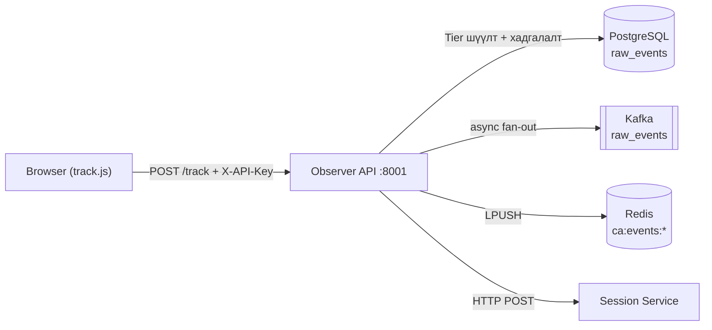

# Observer Service

## Тойм

| | |
|---|---|
| **Нэр** | Observer Service |
| **Port** | 8001 |
| **Технологи** | Python 3.11+, FastAPI, asyncpg, aiokafka, redis.asyncio |
| **Төрөл** | REST API + Event Producer |
| **Хийдэг зүйл** | Browser-ийн clickstream event-ийг цуглуулж PostgreSQL-д хадгалах, Kafka болон Redis руу дамжуулах |

## Tier системийн тайлбар

Observer нь 3 түвшний API key ашиглан field-level access control хийдэг:

| Tier | Key Prefix | Талбарын тоо | Зорилго |
|------|-----------|--------------|---------|
| T3 | `tk_basic_` | 23 | Үндсэн page analytics |
| T2 | `tk_smart_` | 43 | E-commerce engagement, UX |
| T1 | `tk_full_` | 54 | Cart, payment, бүрэн checkout |

## Дата урсгал

