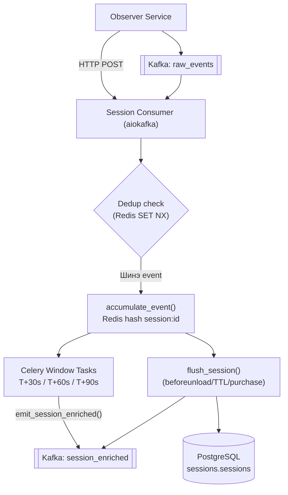

# Session Service

| | |
|---|---|
| **Port** | 8002 |
| **Технологи** | Python 3.11, FastAPI + Uvicorn, Celery, asyncpg, aiokafka, redis-py async |
| **Төрөл** | Hybrid — REST API + Kafka consumer + Celery worker |
| **Хийдэг зүйл** | Raw event-үүдийг Redis-д хуримтлуулж, 30/60/90s window-оор enriched snapshot Kafka руу илгээж, PostgreSQL-д хадгалдаг |

## Дата урсгал

