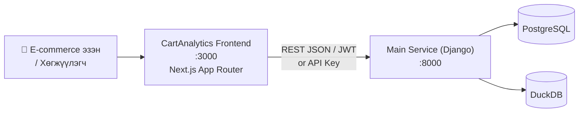

# CartAnalytics Frontend

| | |
|---|---|
| **Нэр** | CartAnalytics Frontend (`cart_analytic`) |
| **Port** | 3000 (dev) |
| **Технологи** | Next.js 16.2.1, React 19, TypeScript 5, Tailwind CSS v4, Recharts v3 |
| **Эзэмшигч** | Dorjnyam Erdenetsogt (mjldoko11@gmail.com) |
| **Хийдэг зүйл** | Cart abandonment аналитикийн dashboard — KPI, session diagnosis, SHAP ML explainability, prediction харуулдаг |

## Архитектур

## Dashboard-ийн хэсгүүд

| Хэсэг | Тайлбар |
|-------|---------|
| 📊 KPI Overview | Тойм метрик — abandonment rate, conversion гэх мэт |
| 🔍 Session Diagnosis | Session-ийн S1-S7 оноо |
| 🤖 ML Predictions | Cart abandonment магадлал |
| 💡 Recommendations | AI (Gemini)-ийн Монгол зөвлөмж |
| 👥 Team Management | Багийн гишүүдийг удирдах |

## Одоогийн хувилбар

`0.1.0` (package.json) — хөгжүүлэлтийн үе шат
