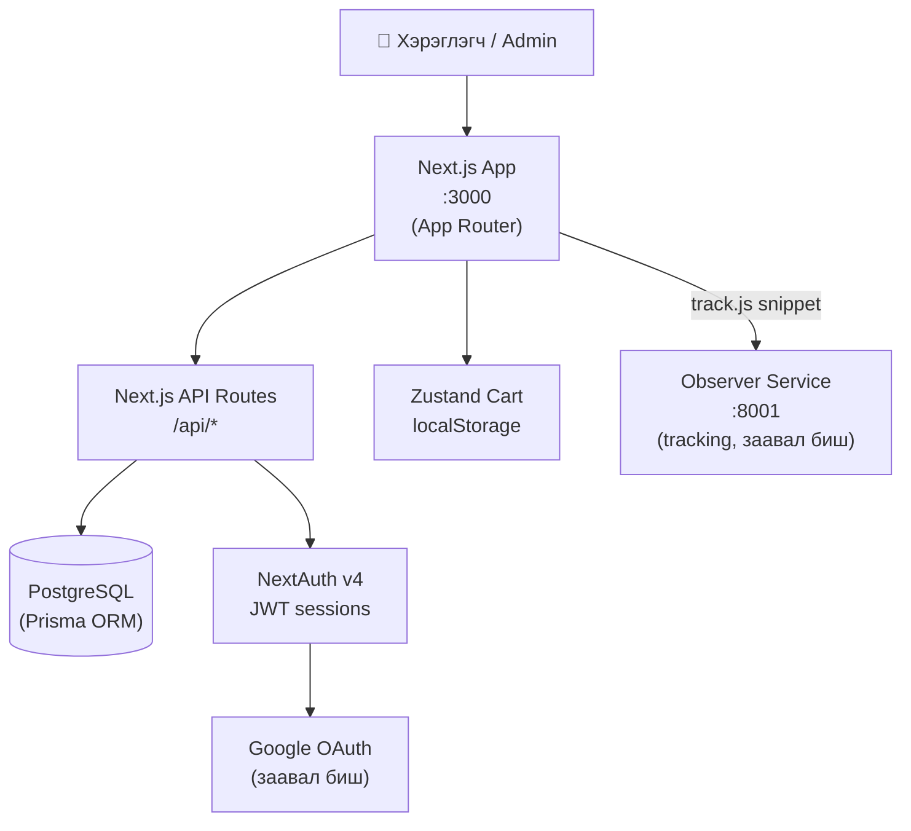

# KICKLAB — Sneaker Store

| | |
|---|---|
| **Нэр** | KICKLAB |
| **Port** | 3000 (dev) |
| **Технологи** | Next.js 16 (App Router), React 19, TypeScript, Tailwind CSS v4, Prisma 7, PostgreSQL, NextAuth v4, Zustand |
| **Зорилтот хэрэглэгч** | Нийтийн: sneaker худалдан авагчид / Admin: дотоод ажилчид |
| **Хийдэг зүйл** | Premium dark-mode sneaker e-commerce — catalog, cart, checkout, хэрэглэгчийн данс, admin Vault |

## Архитектур

## Үндсэн боломжууд

- 🛍️ Бүтээгдэхүүний catalog, хайлт, дэлгэрэнгүй
- 🛒 Zustand + localStorage cart (нэвтрэлтгүй хэрэглэгчдэд)
- 💳 Checkout + захиалгын систем (per-size stock)
- 👤 Хэрэглэгчийн данс — захиалгын түүх
- 🔐 Email/Password + Google OAuth нэвтрэлт
- 🏢 Admin "Vault" — catalog, захиалга, coupon, analytics
